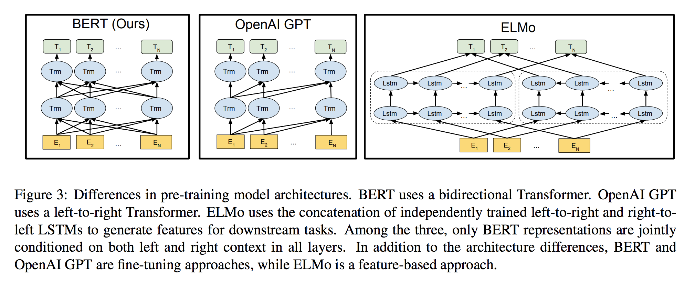

# NLP Study Notes

What's the different?

## Less Context sensitive
For example, "bank" in the context of rivers or any water body and in the context of finance would have the same representation.

* Word2vec / GloVe : encodes a word fixed representation into a single vector. Can't easily handle words they haven't seen before.
* fastText can handle unseen words. Can extend your words.

## More Context sensitive (Context Dependent)

* [BERT](https://arxiv.org/pdf/1810.04805.pdf) (Bidirectional Encoder Representations from Transformers)
	* *fine-tuning-based approach*: trains the downstream tasks by fine-tuning pre-trained parameters.
	* sentences or multiple sentence into a single class vector or multiple kind of contextualized word vectors

* ELMo (Embeddings from Language Models)
	* *feature-based approach*: uses the pre-trained representations as additional features to the downstream task.
	* encodes a word in context into a set of vectors (corresponding to various layers)

## Universal Embeddings - Transfer Learning
Embeddings that are pre-trained on a large corpus and can be plugged in a variety of downstream task models such as sentimental analysis, classification, translation, summary, and abstract.

* fastText: [https://fasttext.cc/](https://fasttext.cc/)
* GloVe: [https://nlp.stanford.edu/projects/glove/](https://nlp.stanford.edu/projects/glove/)
* ELMo: [AllenNLP-ELMo](https://github.com/allenai/allennlp/blob/master/tutorials/how_to/elmo.md)
* BERT: [BERT pretrained models](https://github.com/google-research/bert#pre-trained-models)

## Some Terms in NLP
* Word Similarity
	* lexical 
		* baby :: babies
		* run :: running, runs, ran
	* semantic
		* beautiful :: ['lovely', 'gorgeous', 'wonderful', 'charming', 'beauty']
* Word Analogy
	* man : woman :: son : daughter
	* beijing : china :: tokyo : japan

## L100
* [fastText Tutorial](https://fasttext.cc/docs/en/supervised-tutorial.html)
* [Gensim - Topic Modeling for humans](https://radimrehurek.com/gensim/auto_examples/index.html)
* [Gluon NLP - Tutorials](https://gluon-nlp.mxnet.io/examples/index.html)
* [Doc2Vec Tutorial](https://markroxor.github.io/gensim/static/notebooks/doc2vec-lee.html)
* [Text Simularity - related methods combination](https://medium.com/@adriensieg/text-similarities-da019229c894)
	* [!!! NLP Text Simularity Reference Sources !!!](https://github.com/adsieg/text_similarity): Greate README. List out a lot of fundemential reference paper and source codes.
	* K-means, Cosine Similarity, LDA + Jensen-Shannon distance, Word Mover Distance, Variational Auto Encoder (VAE), Universal sentence encoder, Siamese Manhattan LSTM
* [NLP Town](https://github.com/nlptown/nlp-notebooks): Good starting points with a lot of samples notebooks

## L200
* [Word Embedding and Sentence Embedding](https://github.com/adsieg/text_similarity/blob/master/EMBEDDING%20(word2vec%2C%20FastText%2C%20Glove%2C%20HomeMadeEmbedding).ipynb)
* [BERT - Beyong Word2Vec](https://towardsdatascience.com/beyond-word-embeddings-part-2-word-vectors-nlp-modeling-from-bow-to-bert-4ebd4711d0ec)
* [fastText Model](https://radimrehurek.com/gensim/models/fasttext.html)

## L300
* [How to predict Quora Question Pairs using Siamese Manhattan LSTM - kaggles-quora-question-pairs-competition](https://medium.com/mlreview/implementing-malstm-on-kaggles-quora-question-pairs-competition-8b31b0b16a07)