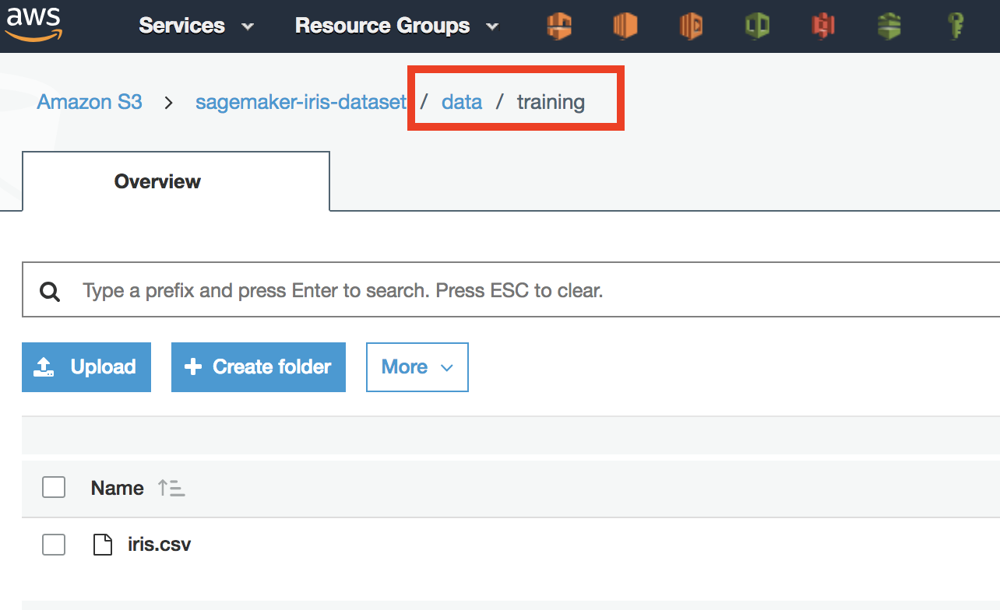
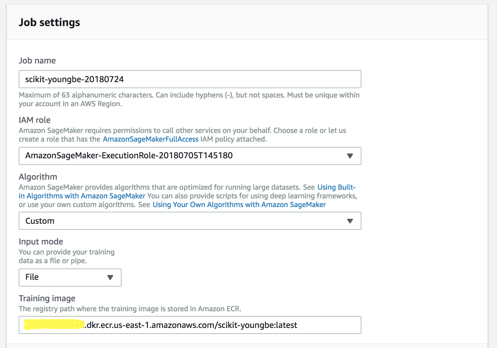
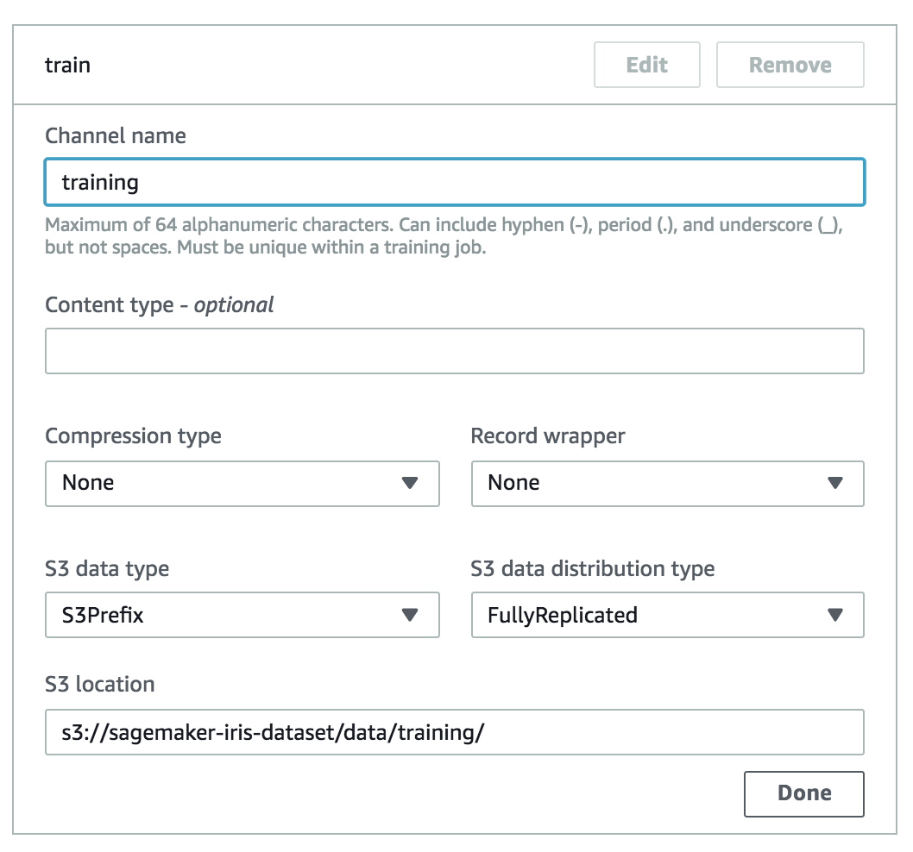
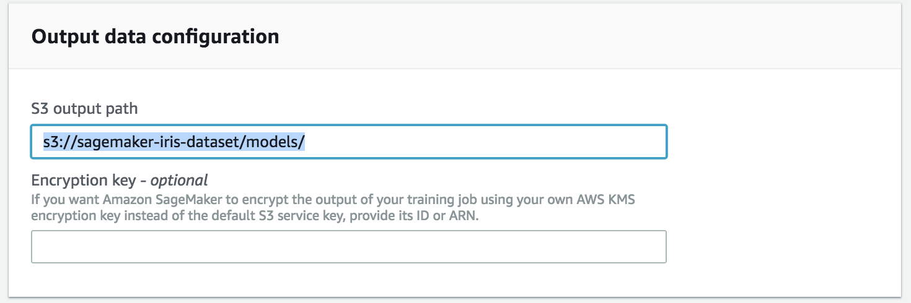
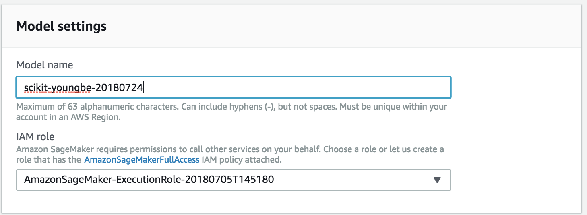
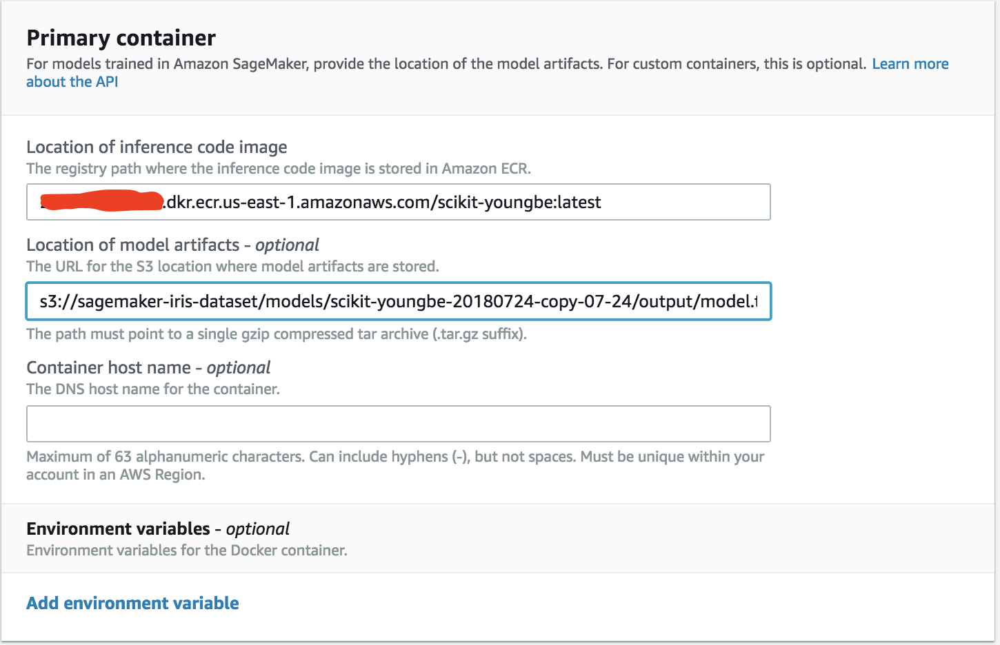
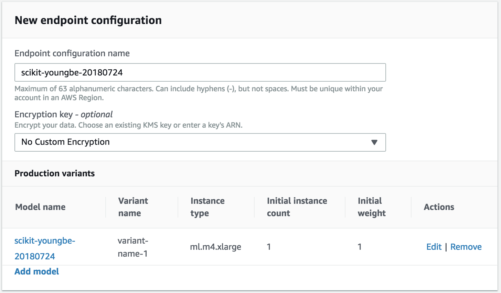
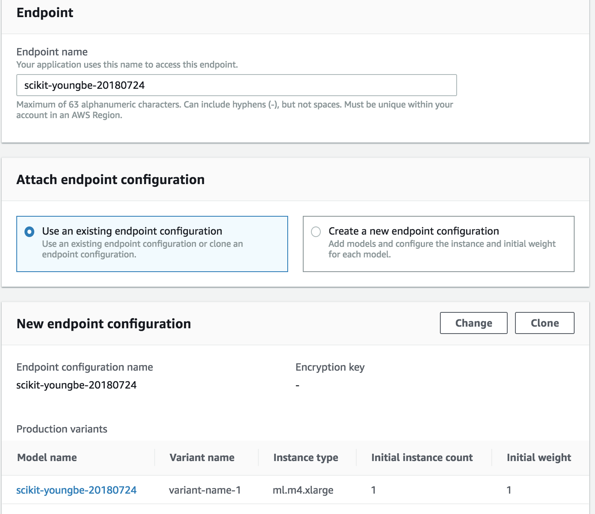
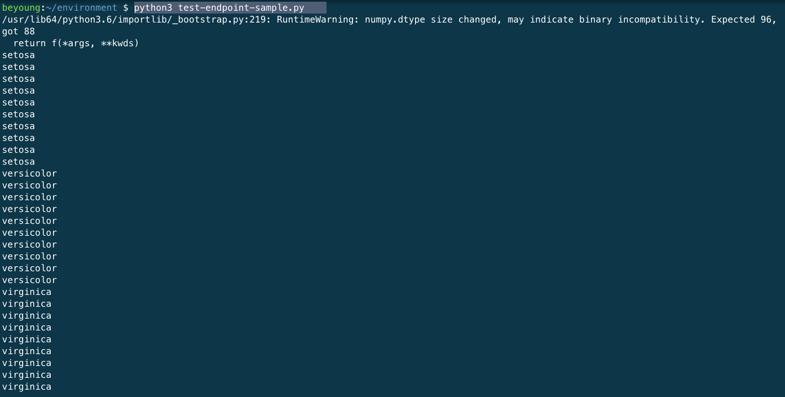

# Bring your own container on Amazon SageMaker Lab

1. create a [cloud9](https://console.aws.amazon.com/cloud9/home?region=us-east-1) environment in `east-us-1` with name: `sagemaker-container-workshop` and type `t2.micro`.

1. In cloud9, bash shell exec:
`git clone https://github.com/awslabs/amazon-sagemaker-examples.git`

1. `cd amazon-sagemaker-examples/advanced_functionality/scikit_bring_your_own/container/`
2. Build the docker image: `./build_and_push.sh <image-name>`. Image name suggest to use `scikit-<your-name>` format.
	

3. `docker images`: you will see `sckit-<your-name>` with `latest` TAG in your cloud9 and ecr respository.
	

## local training
1. `cd local_test`
2. `chmod +x *.sh`
3. ` ./train_local.sh sckit-<your-name>`
   	
4. `ls test_dir/model/` to check the model output.

### error debug
1. `mv test_dir/input/config/hyperparameters.json test_dir/input/config/hyperparameters.json.bak`
2. `./train_local.sh  sckit-<your-name>` You will see error in the console
3. `cat test_dir/output/failure` to see failure
   
4. `mv test_dir/input/config/hyperparameters.json.bak test_dir/input/config/hyperparameters.json`
5. `./train_local.sh  sckit-<your-name>`

## Local Server Inference
1. `./serve_local.sh <image-name> > output.log`
    
2. Open new shell terminal in cloud9
3. `cd amazon-sagemaker-examples/advanced_functionality/scikit_bring_your_own/container/local_test/`
4. ` ./predict.sh payload.csv text/csv`
    

## Train and deploy using the Amazon SageMaker console

### Upload full data set to s3

* download [Iris data set](https://raw.githubusercontent.com/awslabs/amazon-sagemaker-examples/master/advanced_functionality/scikit_bring_your_own/data/iris.csv) to your computer. Then upload the data set into your s3 bucket. s3 bucket name as `sagemaker-iris-dataset-<your-id>/data/training/`
	

### Create Training Job
* Job name: `scikit-<your-name>-yyyymmdd`
* Algorithm: `Custom`
* Input mode: `File`
* Training image: `<Amazon ECR path>:<tag>`. Can get it from `docker images`
	
* Hyperparameters: `max_leaf_nodes` value: `8`
* Training
	* channel name: `training`
	* s3 location: `sagemaker-iris-dataset-<your-id>/data/training/`
	
* Output data configuration: s3 output path: `s3://sagemaker-iris-dataset-<your-id>/models/`
	
* create training job.
* After training job complete, you will see model in `s3://<bucket name>/models/<job name>/output/model.tar.gz` You can get it from trainig jobs detail page.
	

### Deploy an endpoint
#### Create model 
* model name: `scikit-<your-name>-yyyymmdd`
	
* Primary container: 
	* `<your container path>:<tag>`
	* model artifacts: s3 path with output file `s3://<bucket name>/models/<job name>/output/model.tar.gz`
	
* click create the model

#### Create endpoint configuration
* name: `scikit-<your-name>-yyyymmdd`
* add model: `scikit-<your-name>-yyyymmdd`
	

#### Create an endpoint
* name: `scikit-<your-name>-yyyymmdd`
* select endpoint configuration `scikit-<your-name>-yyyymmdd`
	
* create endpoint

### Test the endpoint
In cloud9, install pip3:

* `sudo easy_install-3.6 pip`
* `sudo /usr/local/bin/pip3 install boto3 pandas`

Download the `test-endpoint-sample.py` in the same github folder.

* modify the bucket name and endpoint
* run `python3 test-endpoint-sample.py`
	

### Reference
* [Blog](https://aws.amazon.com/blogs/machine-learning/train-and-host-scikit-learn-models-in-amazon-sagemaker-by-building-a-scikit-docker-container/)