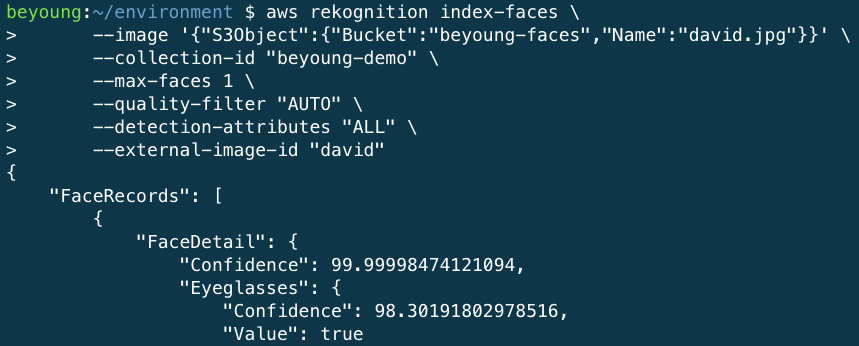
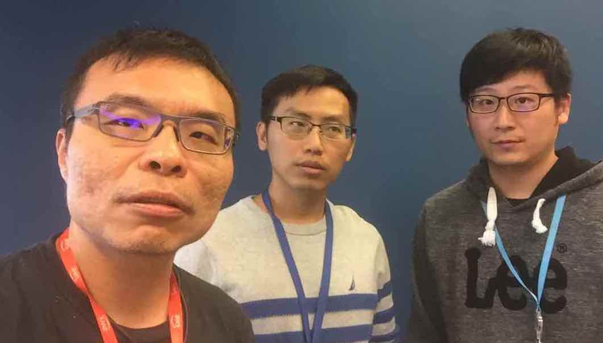
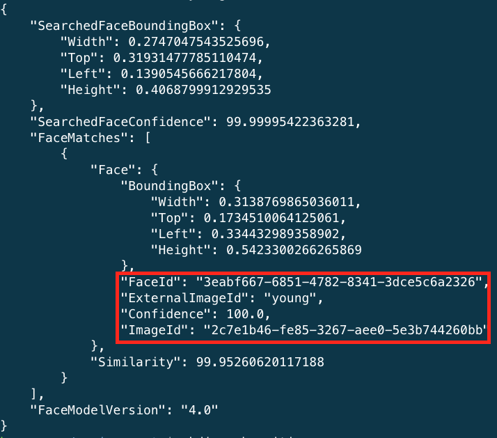
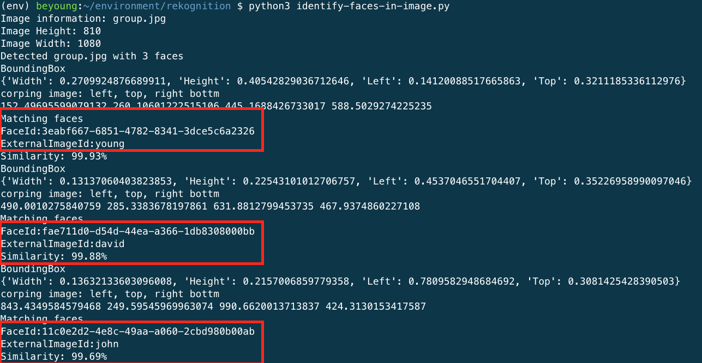

# Face Rekognition

Upload testing images into a s3 bucket. Suggest to input 3 people faces and a group picture with these 3 people.

Open cloud9 to run the following command.

## Step 1: Create a collection

* create collections: `aws rekognition create-collection --collection-id "beyoung-demo"`
* list collections: `aws rekognition list-collections`

## Step 2: Add faces to the collection
Use the following command to add face images into the collection. **Important** : you can use "personal-name" for the external-image-id field. It will help you to get the name in the search faces.

```
aws rekognition index-faces \
      --image '{"S3Object":{"Bucket":"bucket-name","Name":"file-name"}}' \
      --collection-id "collection-id" \
      --max-faces 1 \
      --quality-filter "AUTO" \
      --detection-attributes "ALL" \
      --external-image-id "pernsoal-name.jpg" 
```



List the images:

```
aws rekognition list-faces --collection-id "collection-id"  
```

## Step 3: Search Faces By Image

Use the search faces by image.

**important**
This api only return **the largest face** in the photo.

```
aws rekognition search-faces-by-image \
    --image '{"S3Object":{"Bucket":"bucket-name","Name":"Example.jpg"}}' \
    --collection-id "collection-id"
```





## Step 4: Detect Faces By Image

Get bounding box of all faces.

```
aws rekognition detect-faces \
--image '{"S3Object":{"Bucket":"bucket","Name":"file"}}' \
--attributes "DEFAULT"
```

## Step 5: Crop images and search collections

Steup env in cloud9 console. The source code is [here](./identify-faces-in-image.py)

```
aws s3 cp s3://beyoung-demo/group.jpg group.jpg
virtual env
source env/bin/activate
pip3 install pillow boto3
python3 identify-faces-in-image.py
```



### image to byte

```
image = Image.open(open(photo,'rb'))
stream = io.BytesIO()
image.save(stream, format=image.format) 
image_binary = stream.getvalue()
```

### Call detect faces api
```
response = client.detect_faces(Image={'Bytes': image_binary},Attributes=['DEFAULT'])
```

### Bouding box to image crop
```
x, y = width * faceDetail['BoundingBox']['Left'], height * faceDetail['BoundingBox']['Top']

right, bottom = x + width * faceDetail['BoundingBox']['Width'], y + height * faceDetail['BoundingBox']['Height']

print('corping image: left, top, right bottm')
cropped = image.crop( (x, y, right, bottom) )
```

### Search faces
```
response = client.search_faces_by_image(CollectionId=collectionId,
                                Image={'Bytes': image_binary2},
                                FaceMatchThreshold=threshold,
                                MaxFaces=maxFaces)
```
