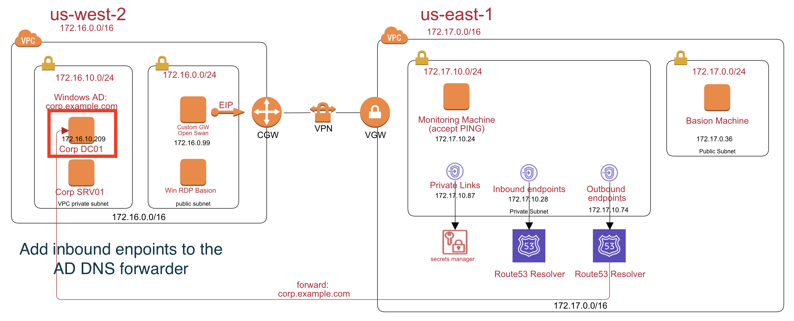

# Enterprise Hybrid DNS solutions on AWS

In this workshop, you will simulate a hybrid cloud environment:

- Corp (on-premise in `us-west-2`): An Windows AD. ie. corp.example.com
- Site-to-Site VPN Connections: DX or software VPN (Openswan)
- Cloud (aws in `us-east-1`): 
	- Basion: An EC2
	- Internal Applications via private links: API Gateway, Secrets Manager, s3, and etc.

## Part1: Setup the site to site VPN
Setup the following diagram to connect Corp (`us-west-2`) and AWS Cloud (`us-east-1`). Please follow the step by step instructions [here](https://github.com/imyoungyang/myAWSStudyBlog/tree/master/openswan)

## Part2: Setup windows AD
Setup a windows RDP basion, Windows Active Directory, and a windows server to join AD domain. Please follow the step by step instructions [here](https://github.com/imyoungyang/myAWSStudyBlog/tree/master/windows-ad-on-ec2) to setup a windows AD on EC2.

## Part3: Private Links for AWS
You need to store some secrets such as DB connection strings in AWS secrets manager. But, you don't want to routes the API calls via public internet. In AWS, you need to create a private links for secrets manager.

Please follow the instrucitons [here](https://github.com/imyoungyang/myAWSStudyBlog/tree/master/vpc-private-link) to create the private links.

## Part4: Route53 Resolver

Follow the step by step [instruction](https://github.com/imyoungyang/myAWSStudyBlog/tree/master/route53-resolver) to setup the route53 resolver. So, the AWS cloud can forward the DNS query for the `corp.example.com` to the on-premise DC.

## Part5: Let corp DNS work with AWS

Add rout53 inbound endpoints into corp dc dns forwarder. The instruction is [here](https://github.com/imyoungyang/myAWSStudyBlog/tree/master/win-dns-forwarder)

## Part6: Verify DNS Query Corp Machines in AWS

1. Login to the AWS basion machines and run command `nslookup the corp.example.com`. You should get the DNS result from route53 resolver via corp AD.

	

2. Login to corp SRV01 machine. run command `nslookup secretsmanager.us-east-1.amazonaws.com`. You should get the private link ips.

	
	
## Part7: Setup the secrets manager and lambda function

In this step, you will store your application secrets in the secrets manager. The secrets manager support KMS, key rotation, and DB connection strings. You can use a lambda funciton in the VPC to retrieve the secrets. The instructions is [here](

