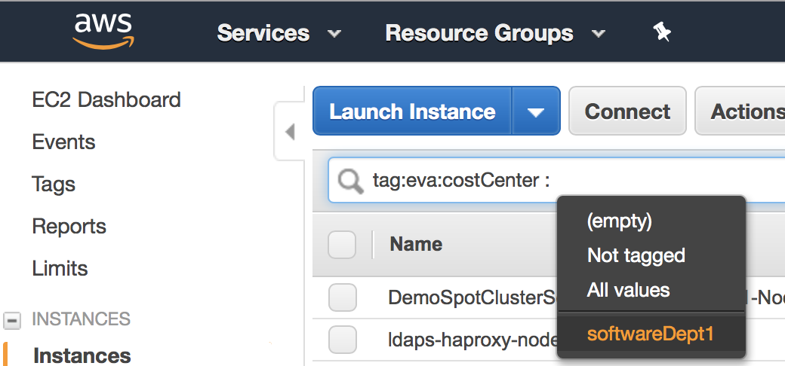

# Create users and group
Adminstor's works:

1. create a dev account without any access: dev@evaair.com
2. create a group `eva-developers-sd1` and add dev@evaair.com to this group

# Setting EC2

### Define the Resource tags

Adminstor's works:

* Read [AWS Tagging Strategies](https://aws.amazon.com/answers/account-management/aws-tagging-strategies/)
* Admin: create an EC2 with the following tags:
	* Business Tags:
		* eva:project: `starAlliance`
		* eva:costCenter: `softwareDept1`
	* Technical Tags:
	   * Name: `eva-demo-ec2`
		* eva:applicationID: `admPortal`
		* eva:appRole: `webServer`
		* eva:environment: `dev`

dev@evaair.com works:

* login aws console
* switch to ec2 > instances. dev does not see any ec2 instances.

### EC2 with different groups and different permissions:

Ref [IAM_UseCases](https://docs.aws.amazon.com/IAM/latest/UserGuide/IAM_UseCases.html), Usually, define the following three groups for EC2: 

* System administrators – Need permission to create and manage AMIs, instances, snapshots, volumes, security groups, and so on.

* Developers – Need the ability to work with instances only. Attaches a policy to the Developers group that allows developers to call DescribeInstances, RunInstances, StopInstances, StartInstances, and TerminateInstances.

* Managers – Should not be able to perform any Amazon EC2 actions except listing the Amazon EC2 resources currently available.

### Setting EC2 developers IAM policy
Admin's works:

* IAM > Create policy
	* search the following actions: TerminateInstances, StartInstances, RunInstances, StopInstances, DescribeInstances, DescribeTags, DescribeInstanceStatus 

	* Add request condition 
		* key: ec2:ResourceTag
		* Tag key: eva:costCenter
		* Operator: StringEquals
		* Value: softwareDept1

* policy name: `eva-dev-sd1`
* Decription: `Eva Airline Software Developer Div 1.`
* After saved, view the eva-dev-sd1 again, you will see the warning message `There are no actions in your policy that support this condition key.`
* Remove the request conditions for `DescribeInstances, DescribeTags, DescribeInstanceStatus`

* **Notes:**  As of today, these Describe* (read-only) actions don’t support resource-level permissions. If you need to let different BU to see only their BU's machines in AWS console, you need to seperate by different AWS account. [Ref: AWS blogs-Demystifying EC2 Resource-Level Permissions](https://aws.amazon.com/blogs/security/demystifying-ec2-resource-level-permissions/)

#### Attach policy to developer gourp
* Select groups: `eva-developers-sd1` > Permissions tab > Attach Policy > `eva-dev-sd1`

### Login with dev@evaair.com
* In the EC2 Dashboard, navigate to **Tags** and type `eva:` in the **Filter** You will see the numbers of instances

* Navigate to `Instances`, and filter with tags `eva:costCenter` value softwareDept1

* select `eva-demo-ec2` instances. In the actions drop down menu, you can change instance state to `stop`.

* If you stop other ec2 instances whithout tag: `eva:costCenter` and value: `softwareDept1`, you will get error messages: You are not authorized to perform this operation.

