# AWS IAM Policy Ninja Workshop - EC2

## Create users and group
Adminstor's works:

1. create a dev account without any access: dev@evaair.com
2. create a group `eva-developers-sd1` and add dev@evaair.com to this group

## Setting EC2

### Define the Resource tags

Adminstor's works:

* Read [AWS Tagging Strategies](https://aws.amazon.com/answers/account-management/aws-tagging-strategies/)
* Admin: create an EC2 with the following tags:
	* Business Tags:
		* eva:project: `starAlliance`
		* eva:costCenter: `softwareDept1`
	* Technical Tags:
	   * Name: `eva-demo-ec2`
		* eva:applicationID: `admPortal`
		* eva:appRole: `webServer`
		* eva:environment: `dev`

dev@evaair.com works:

* login aws console
* switch to ec2 > instances. dev does not see any ec2 instances.

### EC2 with different groups and different permissions:

Ref [IAM_UseCases](https://docs.aws.amazon.com/IAM/latest/UserGuide/IAM_UseCases.html), Usually, define the following three groups for EC2: 

* System administrators – Need permission to create and manage AMIs, instances, snapshots, volumes, security groups, and so on.

* Developers – Need the ability to work with instances only. Attaches a policy to the Developers group that allows developers to call DescribeInstances, RunInstances, StopInstances, StartInstances, and TerminateInstances.

* Managers – Should not be able to perform any Amazon EC2 actions except listing the Amazon EC2 resources currently available.

### Setting EC2 developers IAM policy
Admin's works: IAM > Create policy

* search the following actions:
	* TerminateInstances
	* StartInstances
	* RebootInstances
	* StopInstances
	* DescribeInstances
	* DescribeTags
	* DescribeInstanceStatus 

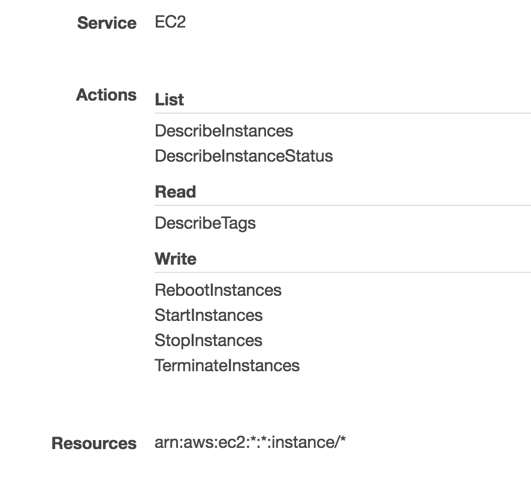

* Add request condition 
	* key: ec2:ResourceTag
	* Tag key: eva:costCenter
	* Operator: StringEquals
	* Value: `softwareDept1`

In the next page:

* policy name: `eva-dev-sd1`
* Decription: `Eva Airline Software Developer Div 1.`

After saved, view the eva-dev-sd1 again, you will see the warning message **There are no actions in your policy that support this condition key.**

* Remove the request conditions for `DescribeInstances, DescribeTags, DescribeInstanceStatus`

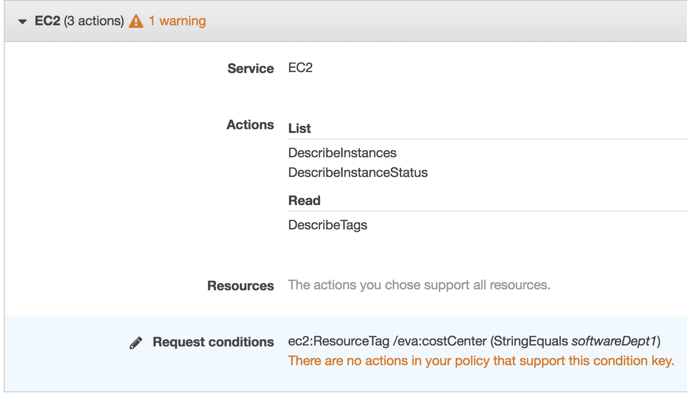

* **Notes:**  As of today, these Describe* (read-only) actions don’t support resource-level permissions. If you need to let different BU to see only their BU's machines in AWS console, you need to seperate by different AWS account. [Ref: AWS blogs-Demystifying EC2 Resource-Level Permissions](https://aws.amazon.com/blogs/security/demystifying-ec2-resource-level-permissions/)

#### Attach policy to developer gourp
* Select groups: `eva-developers-sd1` > Permissions tab > Attach Policy > `eva-dev-sd1`

### Login with dev@evaair.com
* In the EC2 Dashboard, navigate to **Tags** and type `eva:` in the **Filter** You will see the numbers of instances

* Navigate to `Instances`, and filter with tags `eva:costCenter` value softwareDept1

* select `eva-demo-ec2` instances. In the actions drop down menu, you can change instance state to `stop`.

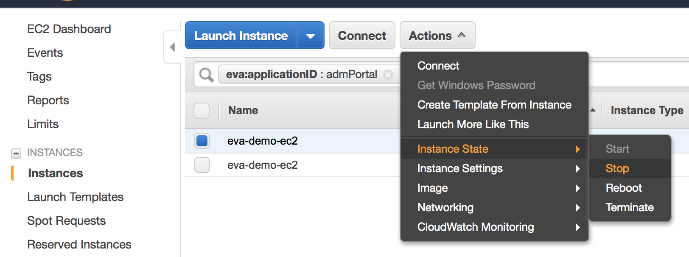

* If you stop other ec2 instances whithout tag: `eva:costCenter` and value: `softwareDept1`, you will get error messages: You are not authorized to perform this operation.

## Grant dev@evaair.com to create ec2

Goal: let developer can open ec2 machines but only for t2.* t3.* family and must with tag `eva:costCenter`, `Name`, and `eva:project`.

* edit policy `eva-dev-sd1`
* Add additional permissions
	* Service: `EC2`
	* Actions: `RunInstances`
	* Resources: related all

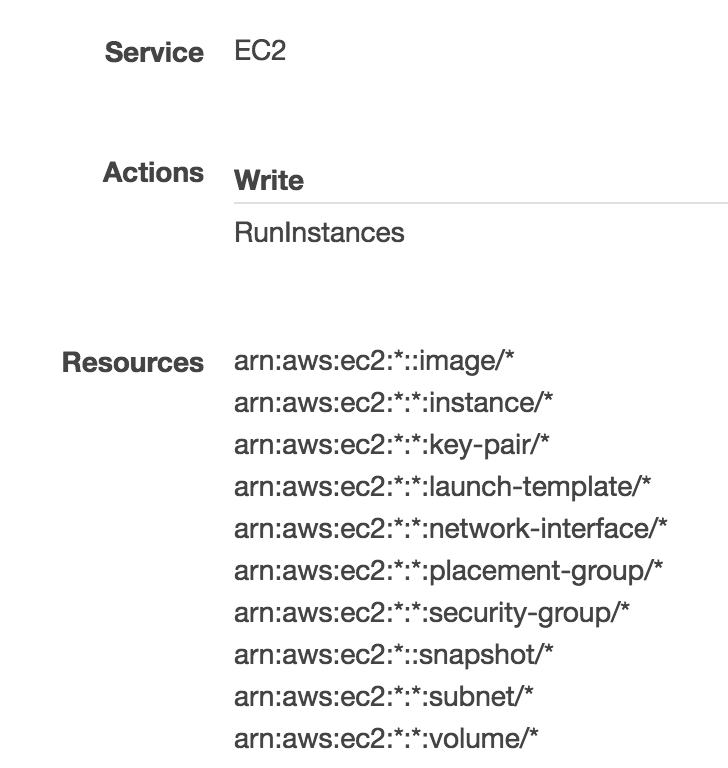

### Condition 1: 
When machine creates must has 3 tags: `eva:costCenter`, `Name`, and `eva:project` :

* Condition key: `aws:TagKeys`
* Qualifier: `For all values in request`
* Operator: `StringEquals`
* Value: `eva:costCenter`, `Name`, and `eva:project`.

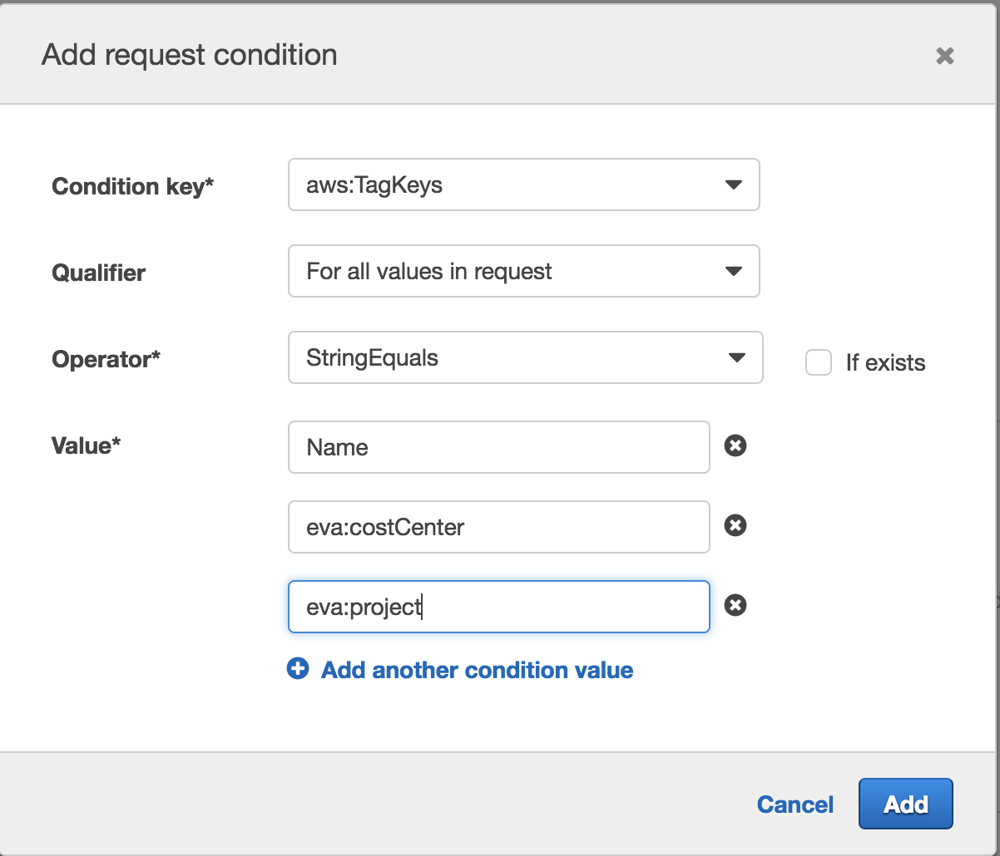

### Condition 2: 
limited ec2 instance types to t2* and t3*
 
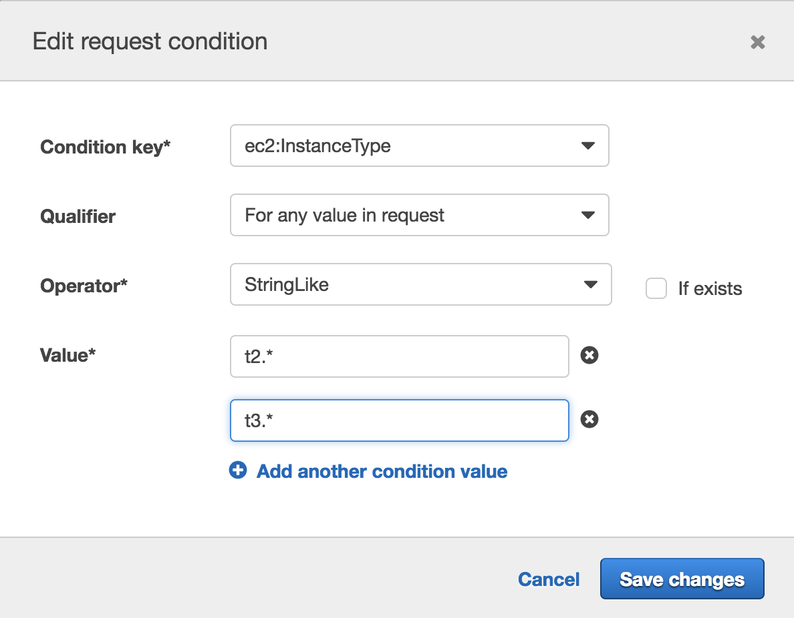

### Condition 3: 

Cost center `eva:costCenter`, value `softwareDept1`

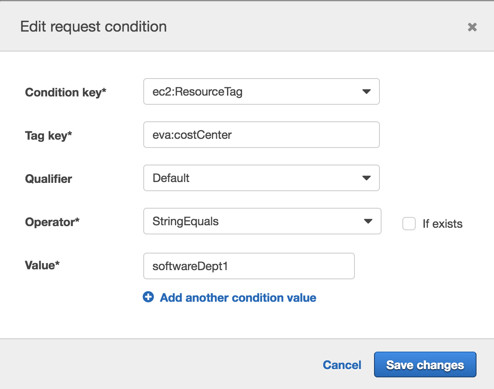

### Confirmed you will have the following three condistions

Click on review policy and finish.

## Debug launch failures - Configure Instance

Login `dev@evaair.com` account and launch ec2 instance. You will stop at the step 2. You can't go to `Step 3. Configure Instance`. Turn on the browser debug mode, you will see the follow HTTP 403 forbidden. 

#### Switch to admin account and fixed the IAM policy

* edit policy `eva-dev-sd1`
* Modify policy
	* Service: `EC2`
	* Actions: 
		* List
			* DescribeAddresses
			* DescribeAvailabilityZones
			* DescribeImages
			* DescribeInstances
			* DescribeInstanceStatus
			* DescribeKeyPairs
			* DescribeRegions
			* DescribeSecurityGroups
			* DescribeSubnets
			* DescribeVolumes
			* DescribeVpcs
		* Read
			* DescribeTags
			* GetPasswordData
	* Resources: related all

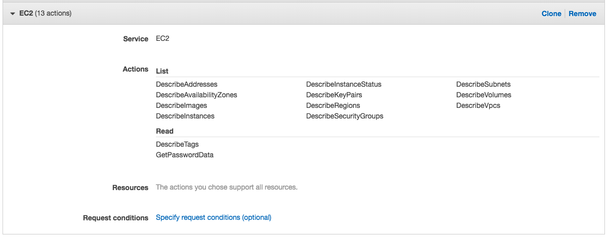

## Debug launch failures - Run Instnace
Login `dev@evaair.com` account and in the last steps, you still see the following error screen.

The error message is encoded and need to use the following command to decode the error messages with Admin role

`aws sts decode-authorization-message --encoded-message`

#### Switch back to Adminstrator

You can use cloud9 bash shell and decode the error message:

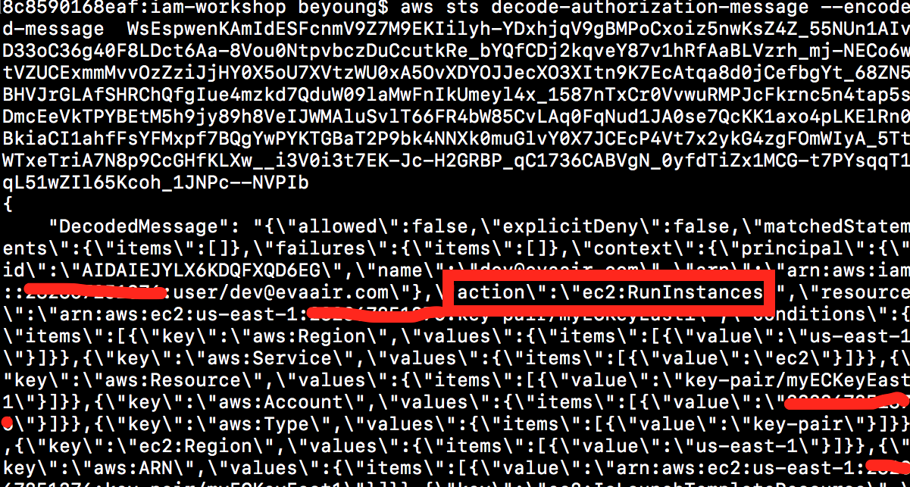

The error message is about `actions:ec2:RunInstances`. If you put into the json formatter, you will see that:

Because you don't allow for the resource `arn:aws:ec2:*:*:instance/*`

#### Fix IAM Policy

##### Add addtional permission

We need to add additional permissions for EC2 RunInstnaces with resource `arn:aws:ec2:*:*:instance/*`. Put the instanceType `t2.* or t3.*` in a seperate rule.

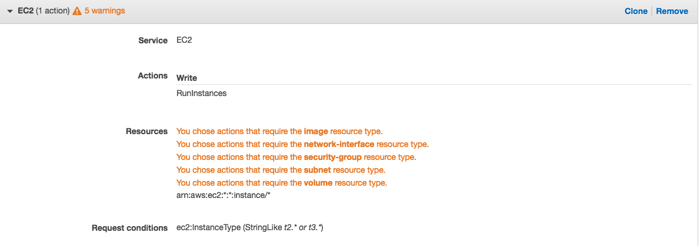

##### Modify original permission

Remove resources `arn:aws:ec2:*:*:instance/*` and request conditions for `t2.* or t3.*` from previous RunInstance permissions statement. Maker sure it likes the following screen:

Click on the review policy and then save it.

Login `dev@evaair.com` account and in the last steps, you still see the following error screen. **Yes, again...**

The error message is encoded and need to use the following command to decode the error messages.

`aws sts decode-authorization-message --encoded-message`

#### Switch back to Adminstrator

You can use cloud9 bash shell and decode the error message:
You will found the error at `"action\":\"ec2:CreateTags\"`

## Debug launch failures - Tags

Back to IAM, edit policy `eva-dev-sd1`. click on`Add additional permissions`

* Services: `EC2`
* Actions: `CreateTags`
* Resources: click `any` on **instance** and **volume**

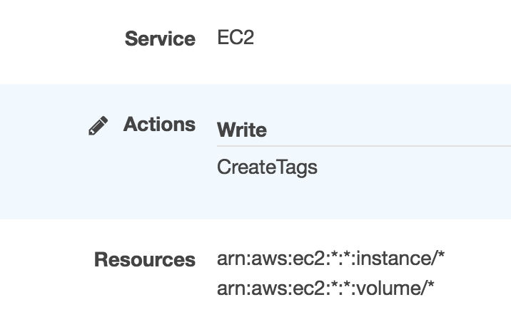

### Conditions 1 Cost Center:
When create the instance, the `eva:costCenter` must be `softwareDept1`

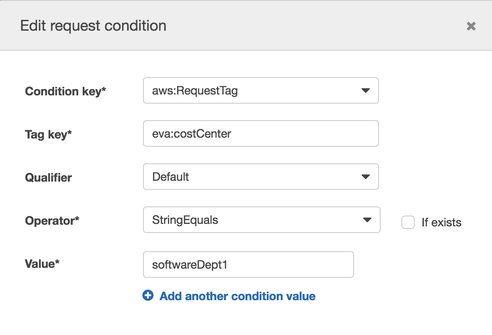

### Conditions 2 Project Name:
Project name should be `starAlliance` or `cloudTeam`

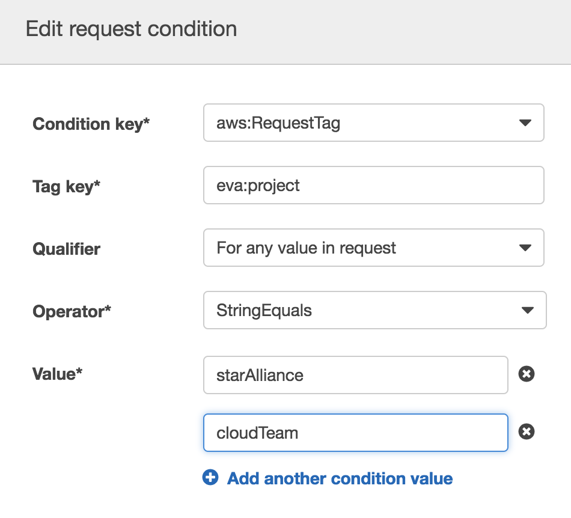

### Conditions 3 Tag Keys:
When create must contains 3 keys: Name, eva:

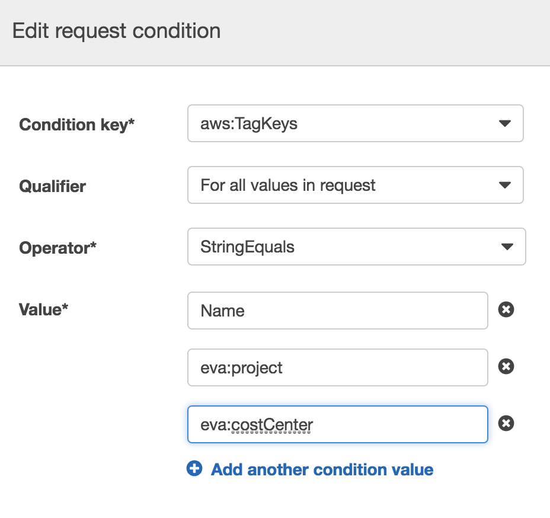

The `CreateTags` configuration is as the following:

### Switch to dev1 account

Now, you can create a EC2 instance successfully with tags: `Name`,  `eva:costCenter`, and `eva:project`

## Oh! Yes, You can Launch EC2.

# Futher challenge
if you want to change ec2 instance project name. How can you do?

## Change launched EC2 instance project name

If you change existing EC2 instance tag `eva:project` from `starAlliance` to `cloudTeam`, you will get the following error screen.

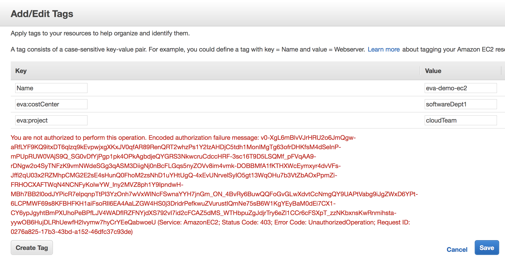

### Fix the modification issue. 

Add a new additional permissions:

Now you can modify the launched EC2 instance project name.

# Conclusions
For the all workshop answers, you can reference this [policy json file](https://github.com/imyoungyang/myAWSStudyBlog/blob/master/iam-workshop/eva-dev-sd1.json)