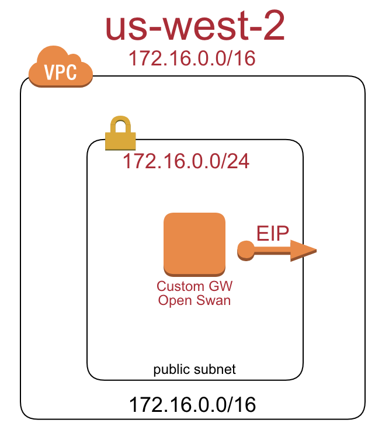
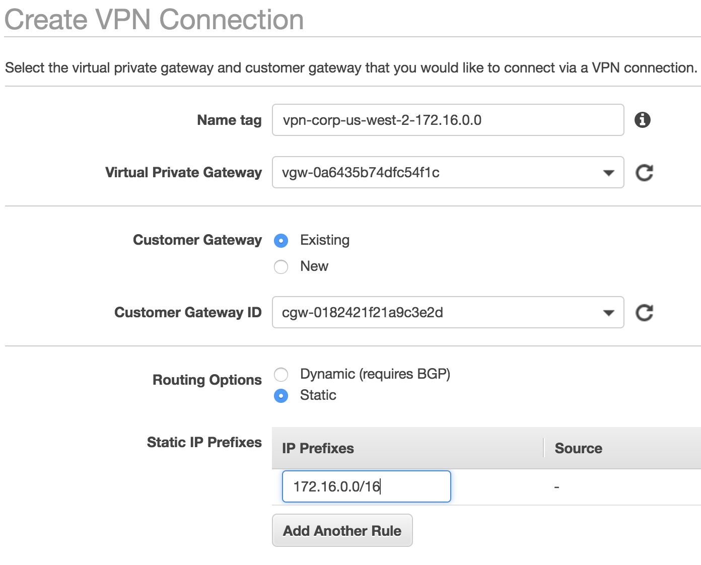
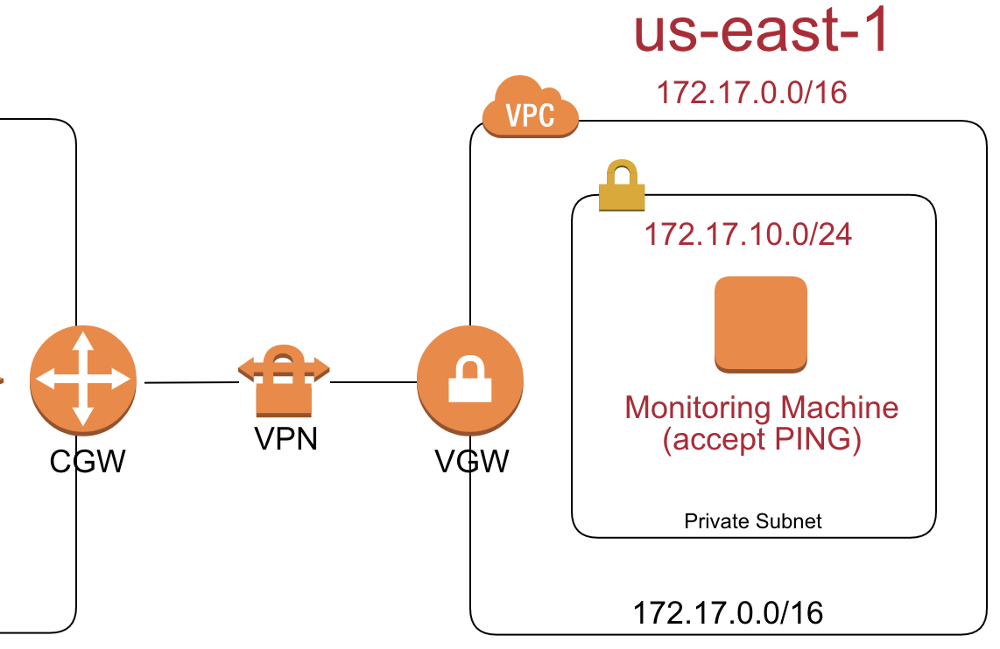
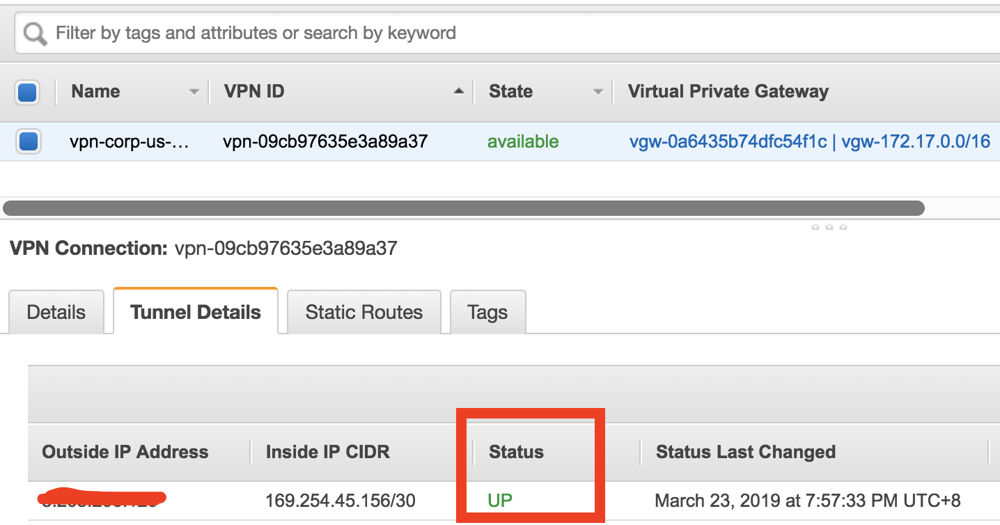
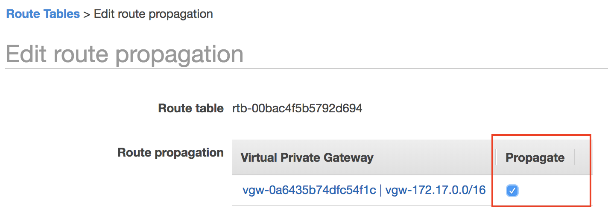

# Setup Open Swan for AWS Site-to-Site VPN Connections

## Introduction
This article details how to configure Openswan + Amazon Linux to connect to a Amazon VPC through its VPN Endpoint. 

It can simulate the environment of `Corp On-premise`, which will setup a VPN connection to their Amazon VPCs.

As well as serve as a practice exercise for SA looking to setup a VPN connection to their Amazon VPC for the first time.


## Requirements
* Two Amazon VPCs with no overlapping IP space
* **Customer Gateway**: EC2 Instance running Amazon Linux on the first VPC (Corp On-premise) acting as the VPN initiating gateway.
* **Monitoring Machine**: EC2 Instance on the second VPC configured to accept PING requests (testing purposes only)

## Process/Summary:
This guide is created using two Amazon VPCs:

- The source VPC is `172.16.0.0/16` at **us-west-2**, 
- Target VPC is `172.17.0.0/16` at **us-east-1**.

## Part 1: Deploy your Amazon VPCs using the AWS Management Console.
1.	`172.16.0.0/16` at **us-west-2**: 

	Deploy your first VPC. Ensure that you are creating a public subnet where the EC2 Instance running Openswan will be deployed to, and assign the Internet Gateway (IGW) to the subnet's route table as the default route.

2.	`172.17.0.0/16` at **us-east-1**:

	Deploy your second VPC. This VPC does not have to have a public subnet. Communication will be coming through the VPN endpoint, so access to the public internet is not necessary. Configure a subnet as well as a properly mapped route table as we will be deploying an EC2 Instance to act as a PING target to confirm that your VPN is working.
	


## Part 2: Deploying the VPN Gateway (EC2 Instance) in the first VPC `172.16.0.0/16` at **us-west-2**:

We will be deploying an EC2 Instance running Amazon Linux to the first VPC. We will need to retrieve the Elastic IP of the source gateway so that we can complete the configuration of our VPN Endpoint on the second VPC.

1.	Using the EC2 Management Console (Web), deploy a `t2.micro` Amazon Linux instance to your public subnet in the first VPC.

2.	Right-click on the EC2 Instance and select "Change Source / Dest Check" to **disable Source/Dest**. checking. This is necessary for routing.

3.	Allocate and Associate an **Elastic IP (EIP)** with the instance. Record the EIP used, as it will be needed for the next part of this guide.



## Part 3: Configuring the VPN Endpoint on the second VPC `172.17.0.0/16` at **us-east-1**:

Since the EC2 Instance will be connecting to the Amazon VPC's VPN Endpoint in `172.17.0.0/16`, we will want to perform this configuration before continuing with the Openswan configuration. VPN origination will occur from Openswan to the second VPC.

### Create the Customer Gateway
1.	Access the VPN Management Console. Ensure that you are in the correct region **us-east-1** for your second VPC `172.17.0.0/16`.
2.	Select the Customer Gateway link on the left-hand navigation pane.
3.	Select Create Customer Gateway.
4.	Select Static Routing and put in the EIP that you associated with your EC2 Instance in Part 2.
5.	Click on Yes, Create.


### Create the Virtual Private Gateway
1.	Select the Virtual Private Gateways link on the left-hand navigation pane.
2.	Select Create Virtual Private Gateway.
3.	Click on Yes, Create.
4.	Select Attach to VPC `172.17.0.0/16`.
5.	Ensure that the drop-down menu is selecting the correct VPC (if you have multiple VPCs in this region), and then click on Yes, Attach.


### Create the VPN Connection, and retrieve the Download Configuration
1.	Select the **Site-to-Site VPN Connections** link on the left-hand navigation pane.
2.	Select Create VPN Connection.
3.	Ensure that the correct Virtual Private Gateway (VGW) and Customer Gateway (CGW) are selected.  Click the radio button labeled Use static routing . Within the IP Prefix field, enter the CIDR value of your first VPC (source network), and then click on Add. For this example, we will be using `172.16.0.0/16` (First VPC).
4.	Click on Yes, Create. This part may take a while.



### Download Configuration of Openswan

5.	After the VPN Connection is created, click on the VPN ID.
6.	Select Download Configuration.
7.	We will want to retrieve the configuration so that we have our pre-shared key(s) that we will need for configuring the VPN tunnel. Drop-down menus should be: Vendor = Openswan, Platform = Openswan, Software = Openswan.
8.	Click on Yes, Download.


## Now, you have done the target environment VPN configuration.



## Part 4: Configuring Openswan on the EC2 Instance
Now that we have the VPN Connection created, we are able to configure Openswan on our EC2 Instance and establish the VPN tunnel between the two VPCs.

1.	SSH into the EC2 Instance in your first VPC.
2.	Install Openswan via YUM: 
	
	```
	sudo yum update -y
	sudo yum -y install openswan
	```
	
3. Edit `/etc/ipsec.conf` to uncomment the line: `include /etc/ipsec.d/*.conf`
3. Edit `/etc/sysctl.conf` to enable ipv4 forward:
   
   ```
   net.ipv4.ip_forward = 1
   net.ipv4.conf.default.rp_filter = 0
   net.ipv4.conf.default.accept_source_route = 0
   ```

4. Apply the changes by executing the command `sudo sysctl -p`
5. Create a new file at `/etc/ipsec.d/aws.conf`:
   - leftid: Customer Gateway ip. i.e: elastic ip for EC2
   - right: VPN tunnel pulbic IP. ie: in **us-east-1** VPC console. The `Site-to-Site VPN Connections` navigation index and then `Tunnel Details` tab of the VPN.
   - leftsubnet: local network behind your openswan server. i.e: `172.16.0.0/16`
   - rightsubnet: remote network on the other side of your VPN tunnel that you wish to have connectivity with. i.e: `172.17.0.0/16`
   - **don't include brackets**

	```
	conn Tunnel1
		authby=secret
		auto=start
		left=%defaultroute
		leftid=<CGW IP>
		right=<VPN ENDPOINT IP>
		type=tunnel
		ikelifetime=8h
		keylife=1h
		phase2alg=aes128-sha1;modp1024
		ike=aes128-sha1;modp1024
		keyingtries=%forever
		keyexchange=ike
		leftsubnet=172.16.0.0/16
		rightsubnet=172.17.0.0/16
		dpddelay=10
		dpdtimeout=30
		dpdaction=restart_by_peer
	```

6. Create a new file at `/etc/ipsec.d/aws.secrets`. Append a line with the format:

   `<CGW IP> <VPN ENDPOINT IP>: PSK "enter_preshared_key_here"`

   **be mindful of the spacing and double quotes!** 
   
   for example:
   
   ```
   34.218.7.xx 3.208.206.xxx: PSK "tUJYtEExqCVs6fGDWOilTNkl------"
   ```

### Run IPSec VNP

1. Start the IPSec service: `sudo service ipsec start`
2. Check the IPSec status: `sudo ipsec verify`
	- **notes for Amzon Linux2**: 
		- remove the line **auth=esp** in `/etc/ipsec.d/aws.conf` 
		- `systemctl status ipsec.service -l` if error, use the command: `journalctl -xe` to check the details.

3. Configure ipsec to start automatically: `sudo chkconfig ipsec on`
4. Disable ICMP Redirect by adding the following to the end of your `/etc/rc.local` file:

	```
	for f in /proc/sys/net/ipv4/conf/*/send_redirects; do echo 0 > $f; done
	for f in /proc/sys/net/ipv4/conf/*/accept_redirects; do echo 0 > $f; done
	```

5. apply the setting by command `sudo chmod +x /etc/rc.d/rc.local`

### Restart to make sure VPN running

1. Check the IPSec status: `systemctl status ipsec.service -l`
2. Check the IPsec configuration:`sudo ipsec verify`
3.	Check the IPsec security associations: `sudo ipsec auto --status`


## Part 5: VPC Routing and Security Groups

Now that the VPN tunnel is properly configured, it is time to review the routes from within the AWS Management Console and confirm that we are routing traffic properly.



### Configure the routes on the destination VPC

1.	Open the VPC Management Console, ensuring that you are in the correct region where your VPN Endpoint is configured. ie: `172.17.0.0/16` at **us-east-1**
2.	Click on `Route Tables` on the left-hand navigation pane.
3.	Locate the route table(s) that is(are) currently in use in your VPC.
4.	The tab of most interest here is the `Route Propagation` tab. This is used to propagate all of the static routes which were defined during the setup of the VPC to your route table(s).
5.	Click "Edit route propagation" and check "Yes"



### Configure the routes on the source VPC

Now for the source VPC, ie. `172.16.0.0/16` at **us-west-2**. You will want to configure the route for the destination VPC's CIDR block. This is achieved by following these steps:

1.	Open the VPC Management Console, ensuring that you are in the correct region where your EC2 Instance running Openswan is hosted. i.e: `172.16.0.0/16` at **us-west-2**.
2.	Click on "Route Tables" on the left-hand navigation pane.
3.	Locate the route table(s) that is(are) currently in use for your VPC.
4.	Add a route to your route table(s) which specify the desired CIDR block to be routed to the proper Elastic Network Interface/Instance ID associated with your EC2 Instance running Openswan.
5.	When challenged, click on "Yes, Create" to confirm that you want to add the route.


### Configure security group on Openswan

Ensure that your security group configuration permits the following:

* Outbound rules:
	* udp/500 to the VPN Endpoint IP(s) (egress)
	* udp/4500 to the VPN Endpoint IP(s) (egress)
* Inbound rules:
	* udp/500 from the VPN Endpoint IP(s) (ingress)
	* udp/4500 from the VPN Endpoint IP(s) (ingress)
	* VPC CIDR Block of the destination block ie. `172.17.0.0/16` is allowed to send traffic as desired, e.g. ALL traffic (ingress)
	* VPC CIDR Block of the source block. You can control which subnets allows to use VPN. In here example, we add `172.16.0.0/16` (ingress)


## Part 6: Testing

Now we can test the tunnel:

1.	Deploy an EC2 Instance in the VPC in the region with the VPN Endpoin. ie: **us-east-1** for your destination VPC `172.17.0.0/16`.

	- with its security group(s) configured to accept PING traffic from the originating VPC's CIDR range. This should be the VPC CIDR block of the VPC which contains the Openswan server.

	
	
2.	Send PING traffic from the Openswan server toward the newly deployed EC2 Instance in the destination VPC. This should make the tunnel active and permit traffic to traverse the VPN tunnel.

	
	
3. Create a basion machine in the public subnet at destination VPC. i.e **us-east-1** for your destination VPC `172.17.0.0/16`. And, then ping the Openswan server.

	 
	
4. Create a PINGable machine in the private subnet at source VPC. ie **us-west-2**. Remember to setup the private subnet route tables. And, then test basion machine can ping this machine. And, this machine can ping monitoring mahcines. 

	
	

## Final Diagram
This is the final architecture diagram

 