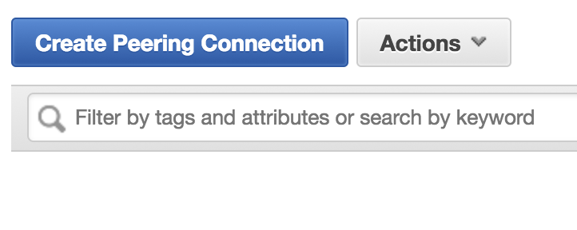
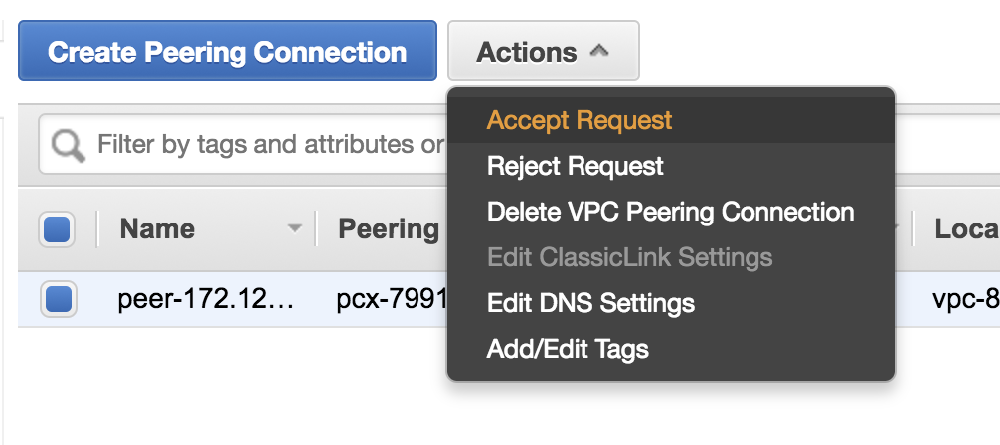
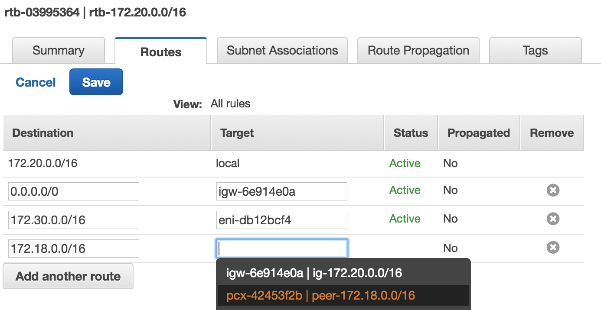
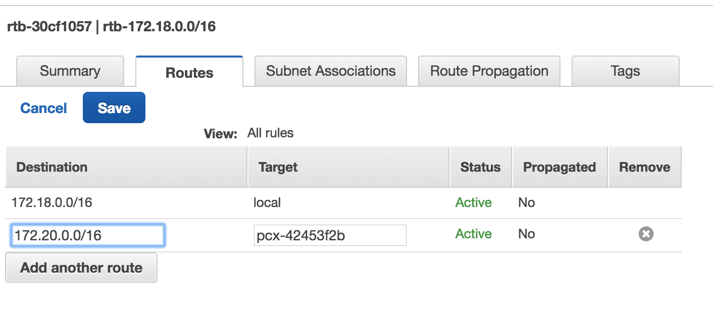
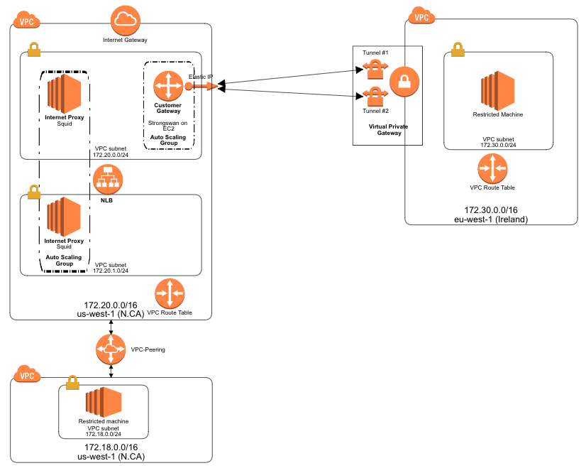

# Stage 10: VPC Peering

You will learn use `vpc peering` to connect 2 VPCs in the same region.

## Create a VPC

1. create a VPC in the `us-west-1`

	- Name: `vpc-172.120.0.0/16`
	- CIDR: `172.120.0.0/16`

2. Create a VPC Peering
	
	
	
	- name: peer-172.120.0.0/16
	- requester: 172.120.0.0/16
	- accepter: 172.20.0.0/16
	
	
	
3. Accept the peering request

	
	
4. Edit route table `rtb-172.20.0.0/16`
	- add 172.120.0.0/16 to pcx peering
	
	
	
5. Edit route table `rtb-172.120.0.0/16`
	- add 172.20.0.0/16 to pcx peering
	
	
	
6. Edit security group `sg-172.120.0.0/16`

	
	
## Verify VPC Peering

1. Create a subnet 172.120.0.0/24 at vpc-172.120.0.0/16

	

2. Launch an EC2 instance at sub-172.120.0.0/24
	- name: restricted-172.120.0.0
	- use existing security group `sg-172.120.0.0/16`

3. ssh to your strongwan machine and ping your ec2 machine at sub-172.120.0.0/24

	
	
4. ssh to restricted machine at sub-172.120.0.0/24. Edit `/etc/yum.conf` and add the following line to the proxy

	```
	proxy=http://nlb-proxy-1ced42e7fcf40e9a.elb.us-west-1.amazonaws.com:3128
	```
	if FQDN did not work, change to the ip address of one of proxy server.

5. execut yum update

	

	**important** remember to add acl configuration in the `/etc/squid/suqid.conf` to allow 172.120.0.0/16.
	
## Take away

Now, you have the following diagram to connect two vpcs in the same region.

