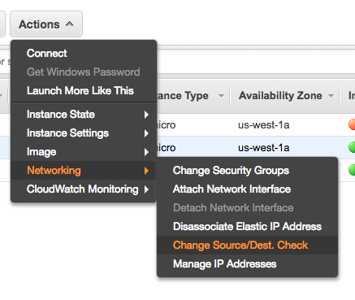
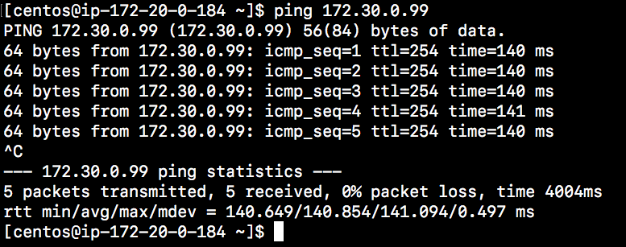
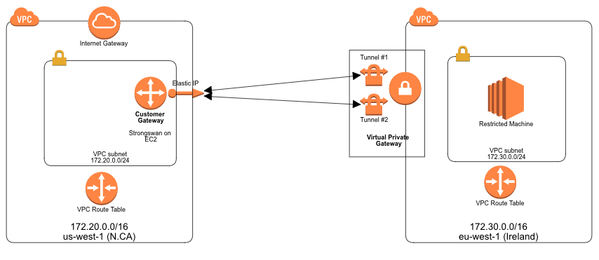

# Stage 5: Connect VPN connections

In this stage, we will setup the customer gateway, strongswan, to connect VPN tunnel. You will understand more on IPSec configuration in AWS.

## Configurate IPSec

ssh to strongswan EC2 at `us-west-1`.

### ipsec.secrets

config `/etc/strongswan/ipsec.secrets`

The format is `<vpn public ip> : <verify protocol> "<your key>"`. 

You can find it in the previous stage [configuration file](config/vpn-13.57.126.76.txt) for tunnel public ip and pre-sharekey. The verify protocol is `PSK`, which means pre-sharekey.

The following is the example:

```
# ipsec.secrets - strongSwan IPsec secrets file
34.240.82.0 : PSK "<psk key>"
52.49.98.107 : PSK "<psk key>"
```

### ipsec.conf

config `/etc/strongswan/ipsec.conf` as the following for aws:

##### default sections: 

- keyexchange=ikev1
- ike=aes128-sha1-modp1024!
- authby=psk
- left=`<your private ip>`
- leftsubnet=`<strongswan subnet>`
- leftid=`<your public ip>`
- rightsubnet=`<remote subnet>`


Left means `Local` i.e the strongswan server. Right means `Remote` i.ie the AWS VPN Connections.

##### conn sections:

- conn name: ususally `vpg-<public ip>`
- right: remote `<pulic ip>`
- auto=add | start, for debugging, I use `add` so that I can manually start it and see the error log.

You can reference the conf file [here](config/ipsec.conf).


```
config setup
       debug=2

conn %default
       mobike=no
       type=tunnel
       compress=no
       keyexchange=ikev1
       ike=aes128-sha1-modp1024!
       ikelifetime=28800s
       esp=aes128-sha1-modp1024!
       lifetime=3600s
       rekeymargin=3m
       keyingtries=3
       installpolicy=yes
       dpdaction=restart
       authby=psk
       left=172.20.0.184
       leftsubnet=172.20.0.0/16
       leftid=13.57.126.76
       rightsubnet=172.30.0.0/16

conn vpg-34.240.82.0
       right=34.240.82.0
       dpdaction=restart
       auto=add

conn vpg-52.49.98.107
       right=52.49.98.107
       dpdaction=restart
       auto=add
```

## Start Strongswan service

- restart service

`sudo systemctl restart strongswan`

- connect vpn tunnel 

`sudo strongswan up vpg-34.240.82.0`

- check the status 

`sudo systemctl status strongswan`


Also, you can login AWS console, switch to `VPC services` in region `eu-west-1`. You can see VPN connections status `UP` as the following screen:


**important**: you can't up two tunnel with the same strongswan machine. The routing will have trouble and can't pass packages correctly.

## Setup Routes

#### Disable source/destination check

1. login AWS console. Switch to EC2 region `us-west-1`.
2. Select your strongswan instance. Choose the actions >> networking >> change source/dest. check.

	

3. Disable the source check. It will become the following:

	

#### Change the route table

select route table: `rtb-172.20.0.0/16` in `us-west-1` region. Add route `172.30.0.0/16` to your strongswan instance.


#### Test ping

Now, you done the VPN connections setting. You can ping your restricted machine in `eu-west-1` region.



#### ssh to restricted machine

`scp` your `eu-west-1` keys to strongswan machine. Now, you can ssh to restricted machine.

## Take away

Now, you have the following architecture diagam:




