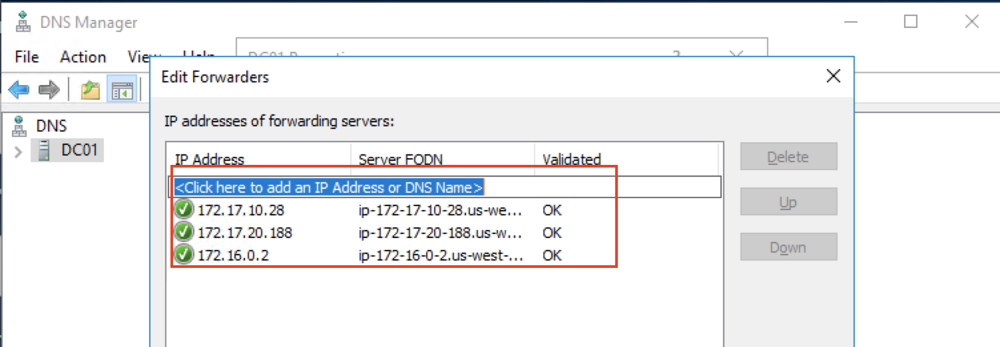

# Add AWS Route53 resolver in On-Premise Windows AD (DNS services)

## Prequirements
* Create Route53 Resolver Inbounds Enpoint. It can accept the on-premise dns forwarder requests. The steps are [here](https://github.com/imyoungyang/myAWSStudyBlog/tree/master/route53-resolver#part2-create-inbound-enpoints)

## Part1: Get the inbound endpoints IP
1. Open route53resovler in AWS console. Select related VPC.
2. Click on the inbounds and you can see the IP address.

## Part2: Login the windows AD and change DNS
1. Login to the Windows AD. Run server manager. In left corner tools, select DNS.
2. In the DNS, right click properties. Edit Forwarders tab:

## Part3: Test

1. Create a private link in Route53 resolver VPC.
2. nslookup the private link and you will get the private ip instead of public internet ip.

## Additional Notes for security

If you need to have the DNS server in pubic subnet, we recommend that you:

1. Update your EC2 Security Group settings to disable internet accessibility, and
2. Disable DNS recursion.
	1. To disable recursion on [BIND](https://www.team-cymru.org/Open-Resolver-Challenge.html)
	2. To disable recursion on [Windows DNS server](https://technet.microsoft.com/en-us/library/cc771738.aspx)